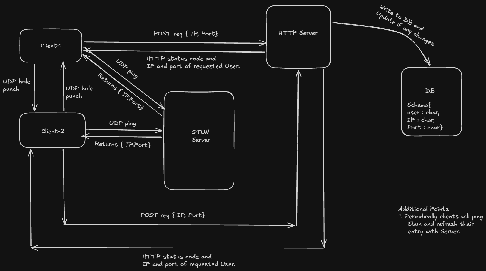

# tailnet

A peer-to-peer encrypted chat application built from scratch in Python. Peers communicate **directly** over UDP — no server ever sees message content. The coordination server only helps peers find each other; once connected, it is completely out of the loop.



---

## How it works

Most chat apps route your messages through a central server. tailnet does not.

1. Each client asks a STUN server *"what does the internet think my IP and port are?"* — this discovers the public-facing endpoint created by your NAT router.
2. The client registers that endpoint with the coordination server (your VPS).
3. When you want to chat with a peer, both clients perform **UDP hole punching** — they send packets to each other simultaneously, which tricks both NAT routers into allowing the traffic through.
4. From that point on, messages travel **directly** between the two machines over an encrypted UDP channel. The coordination server is never involved again.

Each session uses freshly generated NaCl keypairs (X25519 + XSalsa20-Poly1305). The server stores public keys alongside IP/port so peers can establish an encrypted channel without any prior key exchange step.

```
Client A                 Coordination Server (VPS)            Client B
   │                              │                               │
   │── POST /register ───────────►│                               │
   │                              │◄─── POST /register ───────────│
   │                              │                               │
   │── GET /peer/clientB ────────►│                               │
   │◄── {ip, port, public_key} ───│                               │
   │                              │                               │
   │◄════ UDP hole punch ════════════════════════════════════════►│
   │                              │                               │
   │◄════ direct encrypted UDP chat (server not involved) ══════►│
```

---

## Repository structure

```
tailnet/
├── client/
│   ├── client.py          # TUI client — all peer discovery, hole punching, chat UI
│   ├── stun_client.py     # Raw STUN implementation (RFC 5389, XOR-MAPPED-ADDRESS)
│   └── encrypt.py         # NaCl box encryption helpers
├── server/
│   └── main.py            # FastAPI coordination server — registration, discovery, connection requests
├── requirements.txt       # Python dependencies
├── .env.example           # Environment variable template
└── Untitled-2026-06-11-1028.png   # Architecture diagram
```

---

## Prerequisites

- Python 3.11+
- A public VPS with an open port (for the server — **required**)
- Two machines on different networks (to test hole punching)

---

## Server setup (VPS)

The server is a lightweight FastAPI app backed by SQLite. It must run on a machine with a **public IP address** — a VPS, cloud instance, or any server reachable from the internet. It does **not** relay chat traffic; it only stores peer endpoints and connection requests.

### 1. Clone the repo on your VPS

```bash
git clone https://github.com/nav-jk/tailnet.git
cd tailnet
```

### 2. Create a virtual environment and install dependencies

```bash
python3 -m venv .venv
source .venv/bin/activate
pip install -r requirements.txt
```

### 3. Open the firewall port

```bash
sudo ufw allow 8000
```

### 4. Run permanently with systemd

Create the service file:

```bash
sudo nano /etc/systemd/system/tailnet.service
```

Paste the following, replacing the paths with your actual clone location:

```ini
[Unit]
Description=tailnet coordination server
After=network.target

[Service]
User=root
WorkingDirectory=/root/tailnet/server
Environment="PATH=/root/tailnet/.venv/bin"
ExecStart=/root/tailnet/.venv/bin/uvicorn main:app --host 0.0.0.0 --port 8000
Restart=always
RestartSec=5

[Install]
WantedBy=multi-user.target
```

Enable and start:

```bash
sudo systemctl daemon-reload
sudo systemctl enable tailnet
sudo systemctl start tailnet

# Verify it's running
sudo systemctl status tailnet
```

Check logs at any time with:

```bash
sudo journalctl -u tailnet -f
```

After a code change, pull and restart:

```bash
git pull
sudo systemctl restart tailnet
```

The SQLite database (`minitail.db`) is created automatically on first run inside `server/` and persists across restarts. Peer registrations expire automatically after 90 seconds of inactivity — the client heartbeats every 30 seconds to stay alive.

---

## Client setup

### 1. Clone the repo

```bash
git clone https://github.com/nav-jk/tailnet.git
cd tailnet
```

### 2. Set the server URL

```bash
cp .env.example .env
```

Open `.env` and replace the value with your VPS's public IP:

```env
BASE_URL=http://YOUR_VPS_IP:8000
```

### 3. Create a virtual environment and install dependencies

```bash
python3 -m venv .venv

# macOS / Linux
source .venv/bin/activate

# Windows
.venv\Scripts\activate

pip install -r requirements.txt
```

### 4. Run the client

```bash
cd client
python client.py
```

You will be prompted for a username. Your public key is generated fresh each session and registered alongside your IP and port.

---

## Connecting to a peer

Both peers need to be running the client and registered with the same coordination server.

**Peer A** (initiates):
- Select `2 — connect`
- Enter peer B's username
- The client sends a connection request to the server, fetches peer B's endpoint, and begins hole punching

**Peer B** (accepts):
- The main menu polls for incoming requests automatically
- When a request appears, press `y` to accept
- The client fetches peer A's endpoint and begins hole punching from its side

Once both sides have punched simultaneously, the NAT mappings open and direct UDP traffic flows. The chat window opens on both sides. All messages are encrypted end-to-end with NaCl box encryption before leaving the machine.

---

## Technical details

| Component | Implementation |
|---|---|
| NAT traversal | STUN (RFC 5389) using Google's public STUN servers |
| Hole punching | Simultaneous UDP from both sides (20 packets, 100ms apart) |
| Encryption | NaCl box (X25519 Diffie-Hellman + XSalsa20-Poly1305 AEAD) |
| Key exchange | Public keys distributed via coordination server at registration |
| Transport | Raw UDP sockets |
| Coordination | FastAPI + SQLite (aiosqlite), peer expiry after 90s |
| TUI | Rich (panels, tables, styled bubbles, live status) |

### Why not WebRTC?

WebRTC handles STUN, TURN, ICE, DTLS, and codec negotiation automatically. tailnet deliberately avoids it — the goal was to understand what WebRTC is doing underneath. Building STUN discovery, hole punching, and key exchange manually means understanding exactly what ICE candidate gathering means at the socket level, why TURN servers exist (symmetric NAT fallback — not yet implemented here), and what happens when WebRTC fails in production.

---

## Known limitations

- **Symmetric NAT** — some enterprise networks and mobile carriers use symmetric NAT, which assigns a different port per destination. Hole punching fails in this case. A TURN-style relay fallback would solve this but is not yet implemented.
- **Session keys only** — keypairs are regenerated each run. There is no persistent identity, so peers cannot verify each other across sessions.
- **No reconnection** — if the UDP path drops mid-chat (NAT mapping expires, IP changes), there is no automatic reconnect.

---

## License

MIT